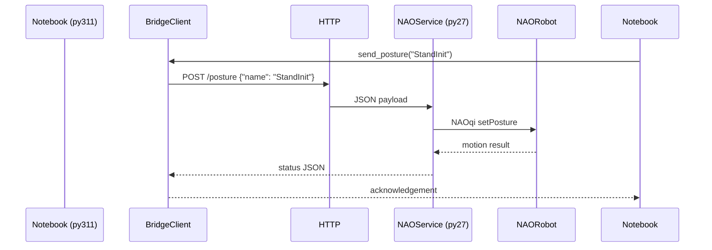

# Reinforcement Learning Labs with NAO Integration

A comprehensive sequence of twelve reinforcement learning labs that progresses from tabular methods to NAO robot deployment. Each lab is a standalone Jupyter notebook with aligned starter and solution code, deterministic evaluation where possible, and reproducible plotting utilities. The curriculum emphasises first-principles understanding while introducing trusted libraries such as Gymnasium and Stable-Baselines3 for comparison.

### Author

**Ahmed Métwalli** – [LinkedIn](https://www.linkedin.com/in/ahmed-m%C3%A9twalli/) | [ResearchGate](https://www.researchgate.net/profile/Ahmed-Metwalli)

Assistant Lecturer (MSc) at AASTMT focused on AI and Data Science. With over 15 publications and multidisciplinary projects spanning sign language, agriculture, surgery, textiles, accounting, signals, embedded systems, IoT, and optical and RF communications, he is now pursuing a Ph.D. on machine-learning-based wireless channel identification.

---

## Project overview

* **Twelve labs** covering foundations, on-policy/off-policy learning, function approximation, library baselines, and NAO deployment.
* **Python 3.11 first** with a thin Python 2.7 bridge for NAO command forwarding.
* **From-scratch algorithms** (Monte Carlo, DP, TD, Q-learning variants, DQN) alongside **Stable-Baselines3** references.
* **Reproducibility** baked in via fixed seeds, saved artefacts, and deterministic tests where feasible.

## Getting started

### 1. Create a Python 3.11 environment

| Platform | Command |
| --- | --- |
| Windows PowerShell | `env\\create_env.ps1 -Name rl-labs-nao` |
| Linux/macOS Bash | `bash env/create_env.sh rl-labs-nao` |

Both scripts will:
1. Create a `.venv/rl-labs-nao` directory if it does not already exist.
2. Activate the environment for the current shell session.
3. Install the pinned requirements.

You can also perform the steps manually:

```powershell
python -m venv .venv\rl-labs-nao
.\.venv\rl-labs-nao\Scripts\Activate.ps1
pip install -r requirements.txt
```

```bash
python3.11 -m venv .venv/rl-labs-nao
source .venv/rl-labs-nao/bin/activate
pip install -r requirements.txt
```

After activation, register an IPython kernel:

```bash
python -m ipykernel install --user --name rl-labs-nao --display-name "RL Labs (py311)"
```

### 2. Install NAO bridge prerequisites

The Python 2.7 NAO service uses the official NAOqi SDK. Copy the SDK wheel or folder into the robot or host machine and install the dependencies listed in `bridge/py27_nao_service/requirements.txt` within a Python 2.7 environment. Full details are in the bridge README.

### 3. Run the notebooks

1. Launch Jupyter Lab or Notebook: `jupyter lab` (preferred) or `jupyter notebook`.
2. Open any lab under `labs/` and ensure the kernel is set to **RL Labs (py311)**.
3. Execute the notebook top to bottom. Each notebook saves its figures to `assets/figures/` and writes tables or artefacts under `assets/data/` when applicable.

> **Runtime expectations:** All notebooks finish within 10 minutes on a modern laptop (i7/Ryzen, 16 GB RAM) when executed with the default configuration. Stable-Baselines3 labs document optional extended training that may take longer.

---

## NAO bridge overview

The bridge decouples learning logic (Python 3.11) from NAO's Python 2.7 control stack. Commands are sent via JSON over HTTP.



### Running the bridge

1. **On the robot (or reachable host):**
   ```bash
   # Python 2.7 environment with NAOqi installed
   cd bridge/py27_nao_service
   python server.py --host 0.0.0.0 --port 8000 --nao-ip <robot_ip>
   ```
2. **On the workstation:**
   ```bash
   # Python 3.11 environment
   cd bridge/py311_client
   python send_action.py --host http://<service_ip>:8000 --action posture --payload StandInit
   ```
3. Integrate within notebooks using the helper functions exposed in `send_action.py`. Rate limiting and a simple queue guard prevent command spam; the client sleeps between commands and retries once on network errors.

### Safety first

* Place NAO on a stable, level surface away from edges.
* Keep the robot powered but supervised. Do not leave training unattended.
* Ensure the emergency stop (chest button) is accessible.
* Use conservative motion commands: limit joint velocities, prefer pre-defined postures.
* Throttle commands (`RATE_LIMIT_SECONDS` in `send_action.py`) and use the queue-based deduplicator to avoid rapid repeated motions.

---

## Hardware safety notes

1. Verify torque limits and posture stability before enabling autonomous behaviours.
2. Keep cables clear to avoid tripping NAO.
3. Have a supervisor ready to intervene; never operate NAO in crowded spaces during testing.
4. Log all commands sent during Lab 10 and 11 to correlate behaviour with policy decisions.
5. After each session, guide NAO into a rest posture using the bridge to reduce motor strain.

---

## Grading and assessment

Each lab includes a rubric with the following weightings:

* **Correctness (40%)** – deterministic checks, reference comparisons, and unit tests must pass.
* **Clarity (20%)** – code is commented, notebook narratives explain reasoning, and figures are labelled.
* **Analysis (20%)** – learners discuss hyperparameters, convergence trends, and algorithmic trade-offs.
* **Reproducibility (20%)** – seeds are fixed, saved artefacts allow independent verification, and runtime budgets are respected.

Suggested grading workflow:

1. Execute the provided unit tests (see `labs/**/solutions/tests/`).
2. Review the notebook deliverables and compare against reference plots in `assets/figures/`.
3. Confirm written answers or analysis sections address the guiding questions in each lab README.
4. Award bonus credit for extensions (e.g., new environments, alternative policies) while ensuring baseline requirements are met.

---

## Troubleshooting & reproducibility

* **Seeds everywhere:** Every notebook sets seeds for `random`, `numpy`, and `torch` (if installed). Re-run cells if external libraries introduce non-determinism.
* **Gymnasium warnings:** Some environments print deprecation notices; these are harmless. Ensure `render_mode` is unset for headless execution.
* **Stable-Baselines3 on Windows:** Install Microsoft C++ Build Tools if compilation errors arise. The pinned wheel avoids CUDA dependencies.
* **Plotting issues:** Use `%matplotlib inline` (pre-set in notebooks) and verify that `assets/figures/` is writable. On Windows, check antivirus settings that may block file creation in the repository.
* **NAO connectivity:** Ensure ports are open between the workstation and robot host. The bridge logs HTTP status codes to aid debugging.
* **Deterministic tests:** When modifying solution code, run `pytest` to validate `labs/03_dynamic_programming_pi_vi/solutions/tests/test_vi_pi.py` and other deterministic checks.

---

## Repository layout

```
rl-labs-nao/
  common/              # Shared utilities for labs and solutions
  labs/                # Twelve lab notebooks with guides and solutions
  bridge/              # Python 3.11 client and Python 2.7 NAO service
  env/                 # Virtual environment helper scripts
  assets/              # Saved figures and data artefacts
  requirements.txt     # Pinned dependencies for Python 3.11
  pyproject.toml       # Tooling configuration (Black, coverage, pytest)
  setup.cfg            # flake8, pytest, and packaging metadata
```

Contributions, issue reports, and extensions are welcome. Please respect the deterministic tests and safety guidance when adapting the labs to new robots or environments.
